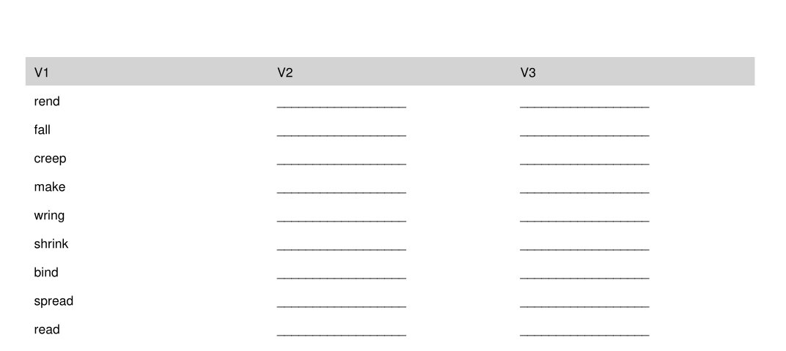
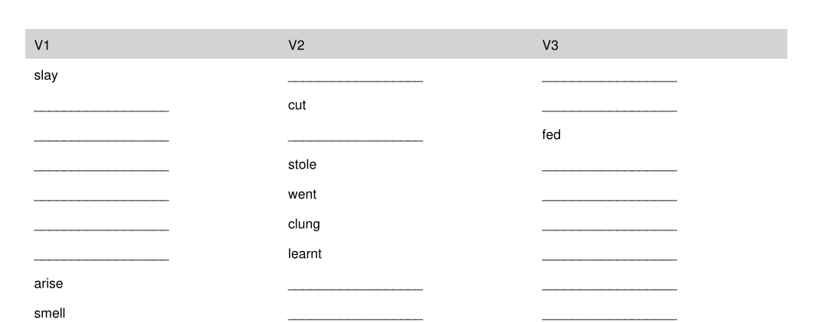

# english-irregular-verbs

## Script to generate PDF exam paper to test knowledge of English irregular verbs

### Test Modes

| | 23-Mode | Random Mode |
|-|---------|----|
| Shows | always 1st form | randomly, 1st, 2nd, or 3rd form |
| Hides | 2nd and 3rd form | randomly, 1st and 2nd, or 2nd and 3rd, or 1st and 3rd form |

## How to run

### Prerequisites

* Python3

### Run

1. Clone this repo
1. Cdir into repo / scripts: `cd english-irregular-verbs/scripts`
1. Create python venv: `python3 -m venv .venv`
1. Activate venv: `. .venv/bin/activate` (or the Windows equivalent)
1. Modify python file settings (optional)
1. Run python script: `python create-exam-paper.py`

### Examples

#### 23-Mode: Testing for knowledge of 2nd and 3rd form

Example download: [irregular_verb_exam_v23_blanks.pdf](doc/irregular_verb_exam_v23_blanks.pdf)

#### random Mode: Testing for knowledge of 1st, 2nd, and 3rd form

Example download: [irregular_verb_exam_random_blanks.pdf](doc/irregular_verb_exam_random_blanks.pdf)

